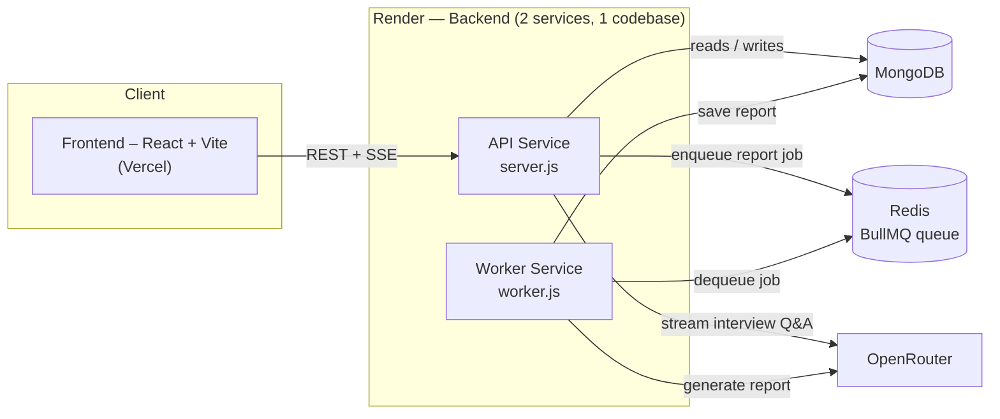

<div align="center">

# 🎤 MockMate

**Practice interviews with an AI that actually read your resume.**

Upload your resume, pick a role and experience level, and go through a live, conversational mock interview with an AI interviewer — then get a detailed interview performance report at the end.

[](https://getmockmate.vercel.app/)


**[🌐 Live Demo](https://getmockmate.vercel.app/)** · **[🐛 Report Bug](https://github.com/tassu1/MockMate/issues)** · **[✨ Request Feature](https://github.com/tassu1/MockMate/issues)**

</div>

---

## 📸 Screenshots

<table>
<tr>
<td width="50%">

**Landing page**


</td>
<td width="50%">

**Choose your track**


</td>
</tr>
<tr>
<td width="50%">

**How it works**


</td>
<td width="50%">

**Login**


</td>
</tr>
<tr>
<td width="50%">

**Dashboard — set up an interview**


</td>
<td width="50%">

**Live interview chat**


</td>
</tr>
<tr>
<td width="50%">

**Adaptive follow-up questions**


</td>
<td width="50%">

**Report — overall score & breakdown**


</td>
</tr>
</table>

**Strengths, weaknesses & suggestions**


---

## ✨ Features

- Resume-based AI interviews — questions are grounded in your actual resume, role, and experience level
- Real-time question streaming over SSE (no waiting for a full response to render)
- Automatic interview wrap-up after 8 questions
- Background report generation with BullMQ + Redis (3 retry attempts, exponential backoff)
- JWT authentication with bcrypt-hashed passwords
- Interview history tied to your account
- Performance report: overall score, category breakdown, strengths, weaknesses, suggestions

---

## 🏗️ Tech Stack

<table>
<tr>
<td valign="top">

**Frontend**
- React 19 + Vite
- React Router
- Axios

</td>
<td valign="top">

**Backend**
- Node.js + Express 5
- MongoDB + Mongoose
- JWT + bcryptjs
- Multer + pdf-parse

</td>
<td valign="top">

**Infra & AI**
- BullMQ + ioredis
- OpenRouter (LLM API, streaming)
- Vercel (frontend)
- Render (API + worker)

</td>
</tr>
</table>

---

## 🏛️ Architecture

MockMate runs as three separate pieces sharing the same MongoDB and Redis:

- **API server (`server.js`)** — auth, resume upload/parsing, interview endpoints. Enqueues report jobs but never generates them itself.
- **Report worker (`worker.js`)** — pulls jobs off the BullMQ queue and calls the LLM to generate reports. The worker runs independently from the API, so report generation doesn't block interview requests.



## 📁 Project Structure

```
MockMate/
├── backend/
│   ├── server.js                  # Express app entry point (API)
│   ├── worker.js                  # Report-generation worker entry point
│   └── src/
│       ├── config/db.js           # MongoDB connection
│       ├── controllers/           # auth, resume, interview logic
│       ├── middlewares/           # JWT auth guard, file upload (multer)
│       ├── models/                # User, Resume, Interview (Mongoose schemas)
│       ├── queue/                 # BullMQ queue, worker, Redis connection
│       ├── routes/                # /api/auth, /api/resume, /api/interview
│       ├── services/              # report generation service
│       └── utils/                 # OpenRouter client, prompt builders
└── frontend/
    └── src/
        ├── pages/                 # Landing, Auth, Dashboard, Interview, Report
        ├── components/            # ProtectedRoute, etc.
        ├── lib/api.jsx             # API client (fetch wrapper + auth token)
        └── styles/                 # per-page CSS
```

---

## 🔌 API Overview

| Method | Endpoint                    | Description                                          | Auth |
|--------|------------------------------|-------------------------------------------------------|:----:|
| POST   | `/api/auth/register`        | Create a new account                                   | ❌ |
| POST   | `/api/auth/login`           | Log in and receive a JWT                               | ❌ |
| POST   | `/api/resume/upload`        | Upload a PDF resume                                    | ✅ |
| GET    | `/api/resume`               | List your uploaded resumes                             | ✅ |
| POST   | `/api/interview/start`      | Start a new interview (`resumeId`, `role`, `level`)    | ✅ |
| POST   | `/api/interview/:id/answer` | Send an answer, stream back the next question (SSE)   | ✅ |
| POST   | `/api/interview/:id/end`    | End the interview early, trigger report generation     | ✅ |
| GET    | `/api/interview/:id/report` | Fetch the generated report                             | ✅ |

---

## 🧭 How It Works

1. Sign up / log in to get a JWT.
2. Upload your resume (PDF) — the backend extracts and stores the text.
3. Start an interview: pick a resume, target role, and experience level.
4. The AI interviewer asks questions one at a time, grounded in your resume and role, streamed back over SSE.
5. After 8 questions, the interview auto-completes and a report job is queued.
6. The worker calls the LLM to generate a structured report, saved to the interview.
7. View your report on the report page once it's ready.

---

## ☁️ Deployment

- **Frontend** → Vercel (static Vite build)
- **API** → Render (Web Service, `node server.js`)
- **Worker** → Render (separate Web Service, same codebase, `node worker.js`)
- **MongoDB** → data store, shared by both backend services
- **Redis / BullMQ** → report job queue, shared by both backend services

Set `VITE_API_URL` in the Vercel project to your deployed API URL.

---

## 🚀 Getting Started

### Prerequisites
- Node.js 18+
- A MongoDB instance (local or [Atlas](https://www.mongodb.com/atlas))
- A Redis instance (local or hosted, e.g. [Upstash](https://upstash.com/))
- An [OpenRouter](https://openrouter.ai/) API key

### 1. Clone the repo
```bash
git clone https://github.com/tassu1/MockMate.git
cd MockMate
```

### 2. Backend setup
```bash
cd backend
npm install
```

Create a `.env` file in `backend/`:
```env
PORT=5000
MONGO_URI=your_mongodb_connection_string
JWT_SECRET=your_jwt_secret
REDIS_URL=redis-url
OPENROUTER_API_KEY=your_openrouter_api_key
```

Run the API server:
```bash
npm run dev
```

Run the report-generation worker **in a separate terminal**:
```bash
npm run dev:worker
```

### 3. Frontend setup
```bash
cd frontend
npm install
```

Create a `.env` file in `frontend/`:
```env
VITE_API_URL=http://localhost:5000/api
```

Run the dev server:
```bash
npm run dev
```

The app will be available at `http://localhost:5173`.

---

## 🗺️ Roadmap

- [ ] Voice interviews
- [ ] Multiple LLM providers
- [ ] PDF report export
- [ ] Interview analytics
- [ ] Docker + CI/CD

Have an idea? Open an [issue](https://github.com/tassu1/MockMate/issues).

---

## 🤝 Contributing

Contributions are welcome — bug fixes, features, or docs improvements.

1. Fork the repo and clone your fork.
2. Create a branch: `git checkout -b feature/your-feature-name`
3. Follow [Getting Started](#-getting-started) to run `frontend` and `backend` locally.
4. Backend logic lives in `backend/src/{controllers,models,routes,services,utils}`; frontend pages in `frontend/src/pages`. If you touch the interview/report flow, remember there are two backend processes (`server.js` and `worker.js`) — test both where relevant.
5. Run `npm run lint` in `frontend/` before submitting UI changes.
6. Open a Pull Request describing what changed and why.

### Good first issues
- Form/input validation on the frontend (auth, resume upload)
- Better error states/messages
- Tests for controllers or utils (currently none)
- CI (lint/build checks) or a Dockerfile for backend/worker
- UI/UX polish on Dashboard, Interview, or Report pages

For larger changes, open an issue first to discuss the approach.

---

## 📄 License

Licensed under the [MIT License](LICENSE).

---

## 🙋 Author

Built by **Tahseen** ([@tassu1](https://github.com/tassu1)).

If you find this project useful, consider giving it a ⭐ on GitHub!