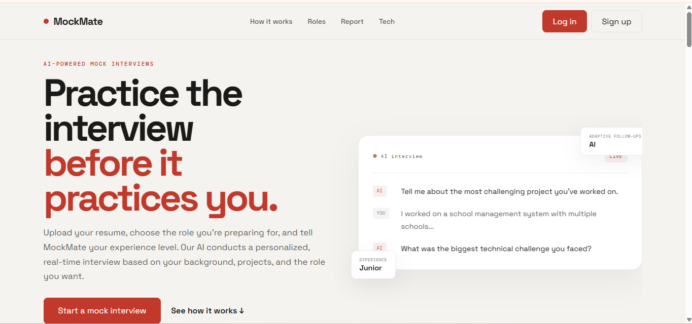
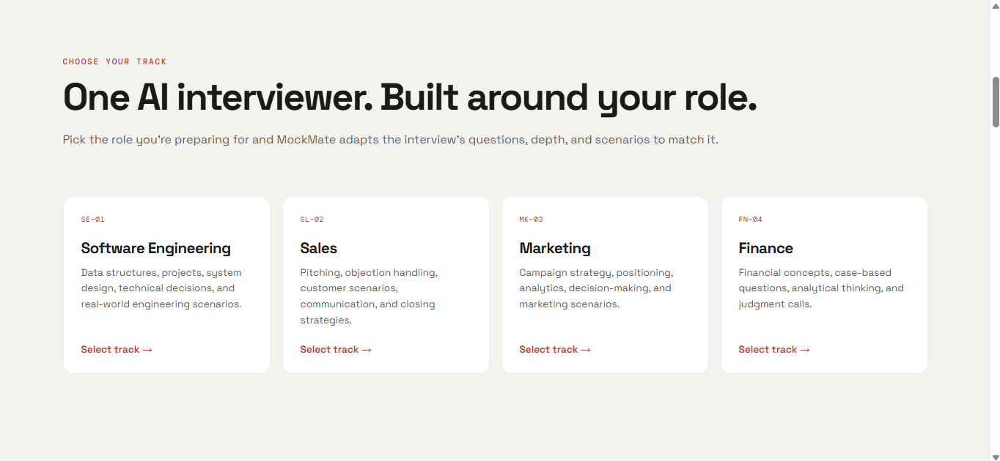
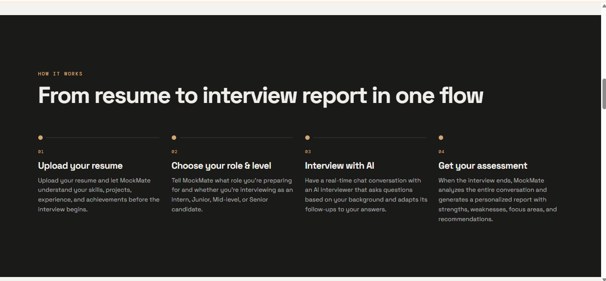
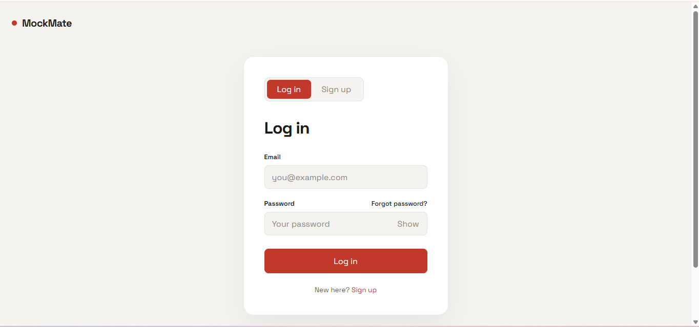
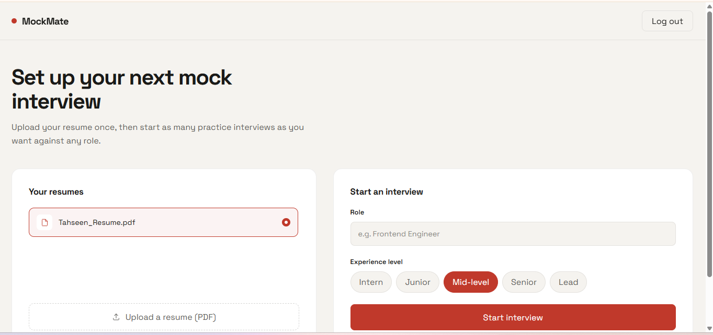
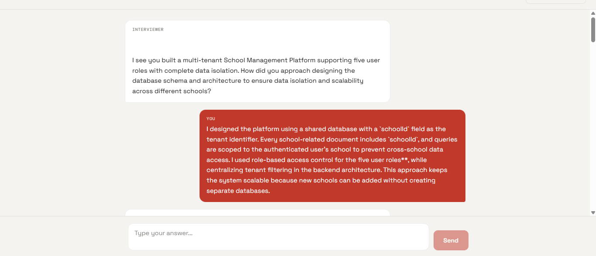
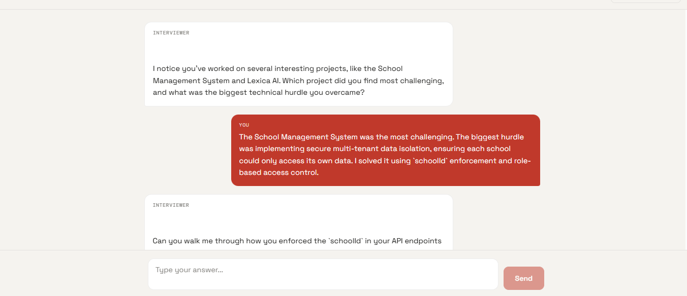
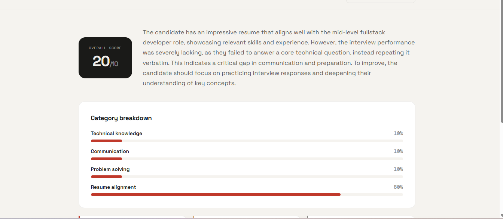
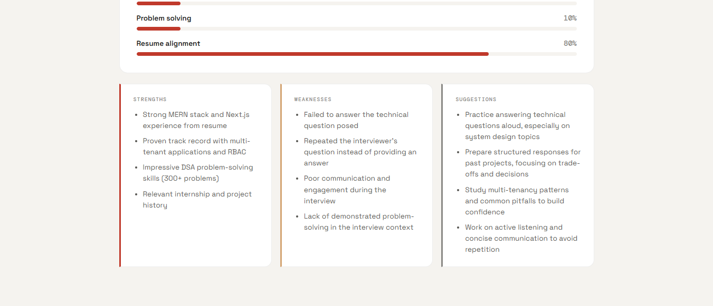
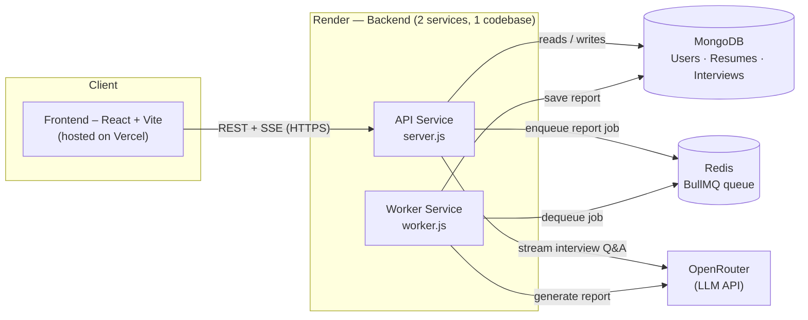

<div align="center">

# 🎤 MockMate

**Practice interviews with an AI that actually read your resume.**

Upload your resume, pick a role and experience level, and go through a live, conversational mock interview with an AI interviewer — then get a detailed, data-driven performance report at the end.

[](https://getmockmate.vercel.app/)


**[🌐 Live Demo](https://getmockmate.vercel.app/)** · **[🐛 Report Bug](https://github.com/tassu1/MockMate/issues)** · **[✨ Request Feature](https://github.com/tassu1/MockMate/issues)**

</div>

---

## 📚 Table of Contents

- [Screenshots](#-screenshots)
- [Features](#-features)
- [Tech Stack](#️-tech-stack)
- [Architecture](#️-architecture)
- [Project Structure](#-project-structure)
- [API Overview](#-api-overview)
- [How It Works](#-how-it-works)
- [Deployment](#️-deployment)
- [Getting Started](#-getting-started)
- [Roadmap](#-roadmap)
- [Contributing](#-contributing)
- [License](#-license)
- [Author](#-author)

---

## 📸 Screenshots

<table>
<tr>
<td width="50%">

**Landing page**


</td>
<td width="50%">

**Choose your track**


</td>
</tr>
<tr>
<td width="50%">

**How it works**


</td>
<td width="50%">

**Login**


</td>
</tr>
<tr>
<td width="50%">

**Dashboard — set up an interview**


</td>
<td width="50%">

**Live interview chat**


</td>
</tr>
<tr>
<td width="50%">

**Adaptive follow-up questions**


</td>
<td width="50%">

**Report — overall score & breakdown**


</td>
</tr>
</table>

**Strengths, weaknesses & suggestions**


> 🗂️ Screenshots live in [`/screenshots`](screenshots) — drop this folder in your repo root (or adjust the paths above) for the images to render on GitHub.

---

## ✨ Features

| | |
|---|---|
| 🔐 **Authentication** | JWT-based signup/login with bcrypt-hashed passwords. |
| 📄 **Resume Upload & Parsing** | Upload a PDF resume; text is extracted server-side and stored to ground the interview in your real experience. |
| 🤖 **AI-Driven Mock Interviews** | An LLM interviewer (via OpenRouter) asks one question at a time, mixing technical and behavioral questions based on your resume, target role, and experience level. |
| ⚡ **Real-Time Streaming** | Interviewer replies stream back to the client over Server-Sent Events (SSE) for a natural, typing-as-you-go feel. |
| 🧠 **Automatic Wrap-Up** | The interview ends automatically after a configurable number of questions (default: 8). |
| 📊 **AI-Generated Reports** | A structured report with overall score, category breakdown (technical knowledge, communication, problem solving, resume alignment), strengths, weaknesses, and actionable suggestions. |
| 🧵 **Queue-Based Report Generation** | Report generation runs on a BullMQ + Redis queue with retries and exponential backoff, so the API stays fast and resilient even if the LLM call fails. |
| 🗂️ **Interview History** | Resumes and past interviews are tied to your account and listed on your dashboard. |

---

## 🏗️ Tech Stack

<table>
<tr>
<td valign="top">

**Frontend**
- [React 19](https://react.dev/)
- [Vite](https://vitejs.dev/)
- [React Router](https://reactrouter.com/)
- [Axios](https://axios-http.com/)
- CSS Modules / plain CSS

</td>
<td valign="top">

**Backend**
- [Node.js](https://nodejs.org/) + [Express 5](https://expressjs.com/)
- [MongoDB](https://www.mongodb.com/) + [Mongoose](https://mongoosejs.com/)
- [JWT](https://jwt.io/) + [bcryptjs](https://www.npmjs.com/package/bcryptjs)
- [Multer](https://www.npmjs.com/package/multer) + [pdf-parse](https://www.npmjs.com/package/pdf-parse)

</td>
<td valign="top">

**Infra & AI**
- [BullMQ](https://docs.bullmq.io/) + [ioredis](https://github.com/redis/ioredis)
- [OpenRouter](https://openrouter.ai/) (LLM API, streaming)
- **Vercel** (frontend hosting)
- **Render** (backend + worker hosting)

</td>
</tr>
</table>

---

## 🏛️ Architecture

MockMate is split into three independently deployable pieces that share the same MongoDB and Redis instances:

- **Frontend (React + Vite)** — a static SPA that talks to the backend purely over HTTPS (REST + SSE).
- **API server (`server.js`)** — handles auth, resume upload/parsing, and interview endpoints. It **enqueues** report jobs but never generates reports itself, so it stays fast and never blocks on LLM calls.
- **Report worker (`worker.js`)** — a separate Node process that only pulls jobs off the BullMQ queue and calls the LLM to generate reports. Fully decoupled from the request/response cycle, so a slow or retried LLM call can never affect interview responsiveness.



**Why split the API and the worker?**

The API needs to respond quickly to interview turns (streamed over SSE), while report generation is a slower, retryable, best-effort background task (up to 3 attempts with exponential backoff). Running them as **separate deployments** means:

- The worker can be scaled, restarted, or redeployed independently of the live API.
- A burst of report jobs — or a flaky LLM call — never adds latency to an active interview.
- Each service gets its own resource limits/concurrency (e.g. `REPORT_WORKER_CONCURRENCY`), tuned separately from the API.

---

## 📁 Project Structure

```
MockMate/
├── backend/
│   ├── server.js                  # Express app entry point (API)
│   ├── worker.js                  # Report-generation worker entry point
│   └── src/
│       ├── config/db.js           # MongoDB connection
│       ├── controllers/           # auth, resume, interview logic
│       ├── middlewares/           # JWT auth guard, file upload (multer)
│       ├── models/                # User, Resume, Interview (Mongoose schemas)
│       ├── queue/                 # BullMQ queue, worker, Redis connection
│       ├── routes/                # /api/auth, /api/resume, /api/interview
│       ├── services/              # report generation service
│       └── utils/                 # OpenRouter client, prompt builders
└── frontend/
    └── src/
        ├── pages/                 # Landing, Auth, Dashboard, Interview, Report
        ├── components/            # ProtectedRoute, etc.
        ├── lib/api.jsx            # API client (fetch wrapper + auth token)
        └── styles/                # per-page CSS
```

---

## 🔌 API Overview

| Method | Endpoint                    | Description                                          | Auth |
|--------|------------------------------|-------------------------------------------------------|:----:|
| POST   | `/api/auth/register`        | Create a new account                                   | ❌ |
| POST   | `/api/auth/login`           | Log in and receive a JWT                               | ❌ |
| POST   | `/api/resume/upload`        | Upload a PDF resume                                    | ✅ |
| GET    | `/api/resume`               | List your uploaded resumes                             | ✅ |
| POST   | `/api/interview/start`      | Start a new interview (`resumeId`, `role`, `level`)    | ✅ |
| POST   | `/api/interview/:id/answer` | Send an answer, stream back the next question (SSE)   | ✅ |
| POST   | `/api/interview/:id/end`    | End the interview early, trigger report generation     | ✅ |
| GET    | `/api/interview/:id/report` | Fetch the generated report                             | ✅ |

---

## 🧭 How It Works

1. **Sign up / log in** to get a JWT stored in `localStorage`.
2. **Upload your resume** (PDF) — the backend extracts and stores the text.
3. **Start an interview** by picking a resume, target role, and experience level.
4. The AI interviewer asks questions **one at a time**, grounded in your resume and role — you respond, and replies stream in real time over SSE.
5. After a set number of questions (default 8), the interview **auto-completes**, and a report-generation job is queued.
6. A background worker calls the LLM to produce a structured **JSON report** (scores, strengths, weaknesses, suggestions), saved to the interview.
7. You view your **performance report** on the report page once it's ready.

---

## ☁️ Deployment

MockMate runs as **three separate deployments** — one Vercel project and two Render services sharing the same codebase:

### 1. Frontend → Vercel
- The `frontend/` folder is deployed as a static Vite build on **Vercel**.
- **Build command:** `npm run build` · **Output directory:** `dist`
- Environment variable set in the Vercel dashboard:
  ```env
  VITE_API_URL=https://<your-render-api-service>.onrender.com/api
  ```
- Live at: [https://getmockmate.vercel.app/](https://getmockmate.vercel.app/)

### 2. Backend API → Render (Web Service #1)
- The `backend/` folder is deployed as a **Web Service** on **Render**, running `server.js`.
- **Start command:** `node server.js`
- Handles all HTTP traffic — `/api/auth`, `/api/resume`, `/api/interview` — including the SSE stream for live interview answers.
- Environment variables:
  ```env
  PORT=10000
  MONGO_URI=...
  JWT_SECRET=...
  REDIS_URL=...
  OPENROUTER_API_KEY=...
  YOUR_SITE_URL=https://getmockmate.vercel.app
  YOUR_APP_NAME=MockMate
  ```

### 3. Report Worker → Render (Web Service #2)
- The **same `backend/` codebase** is deployed a **second time** on Render as its own service — but with the start command pointed at `worker.js` instead of `server.js`.
- **Start command:** `node worker.js`
- Connects to the **same MongoDB and Redis** as the API service, pulls jobs off the `report-generation` BullMQ queue, calls OpenRouter to generate the report JSON, and writes it back to the `Interview` document.
- Exposes a tiny Express health-check route (`GET /`) so Render can verify liveness even though it isn't serving real app traffic.
- Environment variables: same `MONGO_URI`, `REDIS_URL`, `OPENROUTER_API_KEY` as the API service, plus optionally:
  ```env
  REPORT_WORKER_CONCURRENCY=3
  ```

> 💡 **TL;DR:** one codebase, two Render services (`server.js` + `worker.js`) sharing the same database and Redis instance, plus a separate Vercel deployment for the frontend.

---

## 🚀 Getting Started

### Prerequisites
- Node.js 18+
- A MongoDB instance (local or [Atlas](https://www.mongodb.com/atlas))
- A Redis instance (local or hosted, e.g. [Upstash](https://upstash.com/))
- An [OpenRouter](https://openrouter.ai/) API key

### 1. Clone the repo
```bash
git clone https://github.com/tassu1/MockMate.git
cd MockMate
```

### 2. Backend setup
```bash
cd backend
npm install
```

Create a `.env` file in `backend/`:
```env
PORT=5000
MONGO_URI=your_mongodb_connection_string
JWT_SECRET=your_jwt_secret
REDIS_URL=redis://127.0.0.1:6379
OPENROUTER_API_KEY=your_openrouter_api_key
YOUR_SITE_URL=http://localhost:5000
YOUR_APP_NAME=MockMate
```

Run the API server:
```bash
npm run dev
```

Run the report-generation worker **in a separate terminal**:
```bash
npm run dev:worker
```

### 3. Frontend setup
```bash
cd frontend
npm install
```

Create a `.env` file in `frontend/`:
```env
VITE_API_URL=http://localhost:5000/api
```

Run the dev server:
```bash
npm run dev
```

The app will be available at `http://localhost:5173` (default Vite port).

---

## 🗺️ Roadmap

- [ ] Add automated tests (backend controllers, frontend components)
- [ ] Voice-based interview mode (speech-to-text answers)
- [ ] Support multiple LLM providers / model selection
- [ ] Export interview report as PDF
- [ ] Interview history analytics on the dashboard
- [ ] Dockerize backend + worker for easier local/self-hosted setup

Have an idea? Open an [issue](https://github.com/tassu1/MockMate/issues) or start a discussion!

---

## 🤝 Contributing

Contributions are very welcome — whether it's a bug fix, a new feature, or a docs improvement.

1. **Fork** the repo and clone your fork locally.
2. Create a new branch:
   ```bash
   git checkout -b feature/your-feature-name
   ```
3. Follow [Getting Started](#-getting-started) to run both `frontend` and `backend` locally (you'll need MongoDB, Redis, and an OpenRouter API key).
4. Make your changes:
   - Backend logic lives in `backend/src/{controllers,models,routes,services,utils}`.
   - Frontend pages live in `frontend/src/pages`, shared logic in `frontend/src/lib`.
   - If you touch the interview/report flow, remember there are **two backend processes** (`server.js` and `worker.js`) — test both where relevant.
5. Run `npm run lint` in `frontend/` before submitting UI changes.
6. Commit with a clear message and push your branch.
7. Open a **Pull Request** describing what you changed and why. Screenshots/GIFs are appreciated for UI changes.

### Good first issues
- Add form/input validation on the frontend (auth, resume upload).
- Improve error states/messages surfaced to the user.
- Add tests for controllers or utils (there are currently none).
- Add CI (lint/build checks) or a Dockerfile for the backend/worker.
- UI/UX polish on the Dashboard, Interview, or Report pages.

For larger changes, please open an issue first to discuss the approach.

---

## 📄 License

This project is licensed under the [MIT License](LICENSE) — feel free to use, modify, and distribute it. Attribution appreciated!

---

## 🙋 Author

Built with ❤️ by **Tahseen** ([@tassu1](https://github.com/tassu1)).

If you find this project useful, consider giving it a ⭐ on GitHub!